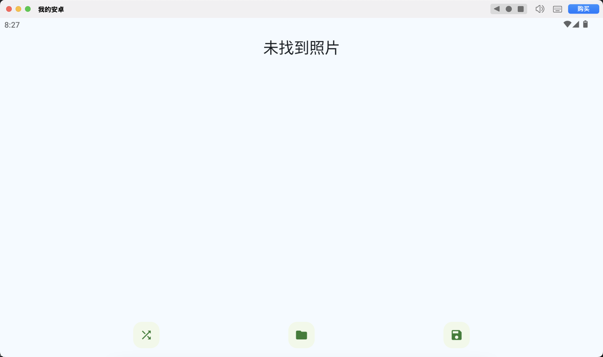

# 随机照片项目

这是一个Android应用，可以帮助用户管理和整理手机中的照片。应用提供了随机浏览照片、将照片移动到指定相册等功能。

## 功能特点

- 📸 随机浏览手机中的照片
- 📁 选择目标相册
- 🔄 一键将照片移动到指定相册
- 🎨 清爽简洁的用户界面
- 🔒 安全的权限管理

## 应用截图



## 安装说明

1. 克隆此仓库到本地：
   ```bash
   git clone https://github.com/oliver7l/my_tools_apk.git
   cd my_tools_apk/A2-随机照片项目
   ```

2. 使用Android Studio打开项目

3. 连接Android设备或启动模拟器

4. 点击运行按钮构建并安装应用

## 使用方法

1. 启动应用后，授予必要的存储访问权限
2. 应用会自动加载手机中的照片
3. 点击"随机切换"按钮随机浏览照片
4. 从下拉菜单中选择目标相册
5. 点击"移动"按钮将当前照片移动到选定相册

## 技术栈

- Kotlin
- Jetpack Compose
- Android MediaStore API
- Material Design 3

## 权限说明

应用需要以下权限：

- `READ_MEDIA_IMAGES` (Android 13+) 或 `READ_EXTERNAL_STORAGE` (Android 12及以下) - 读取照片
- `MANAGE_EXTERNAL_STORAGE` - 管理和移动照片文件

## 开发环境

- Android Studio Hedgehog | 2023.1.1 或更高版本
- Android SDK API 34
- Kotlin 1.9.0

## 版本历史

- v1.0 - 初始版本，包含基本照片浏览和移动功能

## 贡献

欢迎提交问题报告和功能请求！

## 许可证

本项目采用MIT许可证 - 详见LICENSE文件

## 联系方式

如有问题或建议，请通过以下方式联系：

- GitHub: [oliver7l](https://github.com/oliver7l)